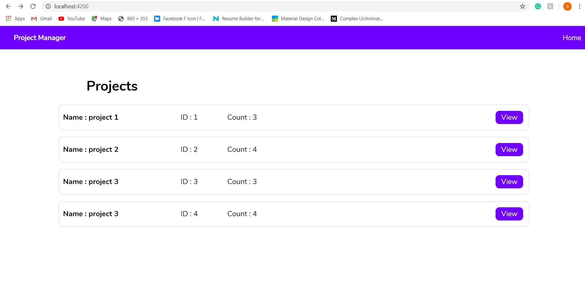
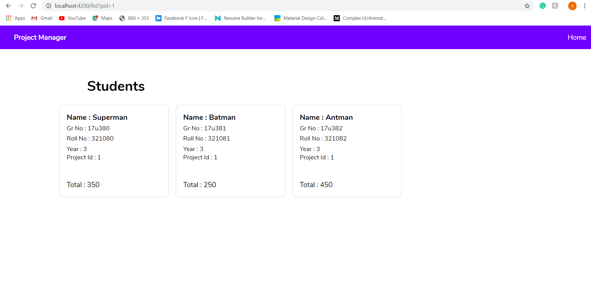

# project-management
the basic angular app with MongoDB database

# basic configuration
1.first install ad run mongodb

2.from mongodb folder , save the project by uncommenting the code and same for student.

3.run the index file with "nodemon index.js" command

4.run andular app with "ng serve --proxy-config proxy.conf.json"

5.now you can see the app on browser

# Previews

